:PROPERTIES:
:ID:       20230508T135522.225628
:END:
#+title: Mobilen Dergi 1
#+author: ---
#+date: Haziran 2023

#+INCLUDE: ./resources/OrgExportSettings/OrgExportMobilenLatexSettings.org

#+CAPTION: Sayı 1: Haziran 2023
#+ATTR_LATEX: :width \textwidth

#+BEGIN_EXPORT latex
\tableofcontents
\newpage
\thispagestyle{empty}
#+END_EXPORT

* Merhaba Dünya
Merhabalar, mobil uygulama geliştirme pratikleri ile ilgili gördüğümüz ve ilgimizi çeken gelişmeleri paylaşmak niyetiyle aylık dergi oluşturmaya niyet ettik.
Burada ilk sayımız ile karşınızdayız.

İlerleyen sayılarımızda konularımızı biraz daha çeşitlendirip, gündemi daha yakından takip etmeye çalışacağız, faydalanmanız niyetiyle. Görüşmek üzere :).

* WWDC 2023 geliyor!
_[[https://tr.linkedin.com/in/suat-karakusoglu][Suat Karakuşoğlu]] tarafından yazıldı._

[[https://developer.apple.com/wwdc23/][WWDC 2023]] sunum takvimi hazır.
[[https://www.apple.com/newsroom/2023/05/apples-worldwide-developers-conference-to-kick-off-june-5-2023/][Apple WWDC 2023 konuları]] da belirlendi.

Keynote sunumu Türkiye saati ile 5 Haziranda [2023-06-05 Mon 20:00] başlayacak.

5-9 Haziran'da gerçekleşecek etkinlikten yeni bir ürün çıkması da muhtemel.

iOS 17 ile beraber Apple duyurduğu [[https://www.apple.com/newsroom/2023/05/apple-previews-live-speech-personal-voice-and-more-new-accessibility-features/][erişilebilirlik]] yeteneklerini daha geliştirdiklerini görüyoruz.

=One More Thing= VR gözlüğü konusundaki atılımların meyvesi bu toplantıda görücüye çıkabilir.

* Navigation Desenleri
_[[https://tr.linkedin.com/in/suat-karakusoglu][Suat Karakuşoğlu]] tarafından yazıldı._

Selamlar, =navigation= mobil uygulamalarda kullanıcının ekranlar arasında nasıl dolaşması gerektiğine dair haritayı sağlamaktadır.
Bu haritanın farklı yaklaşımları mevcut, görsel olarak Frank Rausch tarafından yazılan bu bloğu incelemenizi öneririm.

https://frankrausch.com/ios-navigation

* Netfox ile iOS uygulamalarda network izlemek
_[[https://www.linkedin.com/in/ugurcan-durak/][Uğurcan Durak]] tarafından yazıldı._

#+CAPTION: [[https://raw.githubusercontent.com/kasketis/netfox/master/assets/overview1_5_3.gif][Netfox'u İzlemek için tıkla]]
#+ATTR_LATEX: :width 200px
#+ATTR_HTML: :width 200px
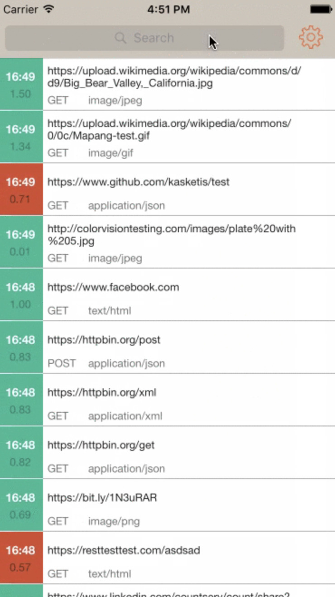

Merhabalar, bu yazıda mobil cihazda network isteklerini detaylı şekilde görüntülemek için kullanılan faydalı olduğunu düşündüğüm *[[https://github.com/kasketis/netfox][Netfox]]* kütüphanesinden bahsedicem.

Çok detaya girmeden genel hatlarıyla nedir? nasıl kullanılır? gibi başlıklarla değineceğim. Hadi başlayalım :)

** Netfox Nedir?
*[[https://github.com/kasketis/netfox][Netfox]]* kütüphanesi, tüm network işlemlerini mobil cihaz üzerinden detaylı bir şekilde görüntüleyebileceğimiz =open source= bir kütüphanedir.

Netfox'u uygulama içerisinde istediğimiz bir anda başlatıp anlık olarak uygulamamızın yapmış olduğu tüm istekleri listeleyebilir ve detaylı bir şekilde =body=, =header=, =response= gibi tüm network etkileşimlerini inceleyebiliriz.

Bu tarz kütüphanelerin en güzel yanı, mobil cihazımız bilgisayara bağlı olmadan da istediğimiz bir anda network log'larına bakabilmektir.
Bu özellik testçiler için oldukça faydalıdır. Çünkü herhangi bir hata anında doğrudan developer'a bildirmek yerine log'ları inceleyip hata hakkında fikir sahibi olabilirler.

** Netfox Nasıl Kullanılır?
=Netfox='un kullanımı ve projeye entegre edilmesi oldukça basittir.

Varsayılan davranışı **shake** olarak belirlenmiş olsada custom bir şekilde istediğimiz bir butona ya da bir view event'ine atayarak Netfox'u başlatabiliriz. Öncelikle projeye nasıl eklenir ona bakalım.

** Netfox'un Projeye Eklenmesi
1. Netfox kütüphanesini **SPM**, **CocoaPods** ve **Carthage** olmak üzere üç ayrı yöntem ile projemize ekleyebiliriz. Bu yöntemlerden herhangi biriyle eklediğinizi varsayarak bir sonraki adıma geçiyorum.

2. Kütüphaneyi projeye ekledik şimdi ise =initiliaze= edeceğiz. Bunun için AppDelegate class'ına gidip aşağıdaki gibi gerekli kodları ekliyoruz.

Netfox Import:
#+INCLUDE: ./resources/OrgExportSettings/OrgExportLatexSourceBlock.org
#+begin_src swift
  #if DEBUG
  import netfox
  #endif
#+end_src

Burada  *#if DEBUG* ve *#endif* kodlarını ekleyerek kodun sadece debug moddayken import olmasını sağlıyoruz. Daha sonra uygulama ilk başlatıldığında hazır hale gelmesini istediğim için aşağıdaki gibi başlatıcı fonksiyonun içerisine kodlarımızı ekliyoruz.

Netfox başlatma:
#+INCLUDE: ./resources/OrgExportSettings/OrgExportLatexSourceBlock.org
#+begin_src swift
  func application(
    _ application: UIApplication,
    didFinishLaunchingWithOptions launchOptions: [UIApplication.LaunchOptionsKey: Any]?
  ) -> Bool {
      #if DEBUG
      NFX.sharedInstance().start()
      NFX.sharedInstance().setGesture(.shake)
      #endif
  }
#+end_src

Burada **start()** methodunu çağırarak Netfox'ı initiliaze ediyoruz ardından **setGesture()** ile Netfox'ın nasıl açılacağını belirliyoruz.

Varsayılan davranışı shake olduğundan özellikle belirtmenize gerek yok örnek olması açısından ekledim. Siz dilerseniz **custom** parametresini geçip daha sonra dilediğiniz yerde **show()** methodu ile açılmasını sağlayabilirsiniz.

** Netfox Özetle
Evet hepsi bu kadar :) Şimdi dilediğiniz gibi cihazı sallayarak ya da atamış olduğunuz bir buton ile Netfox'ı başlatabilir ve log'ları inceleyebilirsiniz.

Daha detaylı incelemek isteyenler için aşağıya link bırakıyorum. Umarım faydalı olur zaman ayırdığınız için teşekkürler.

** Kaynaklar
1. [[https://github.com/kasketis/netfox][Netfox Github Kütüphanesi]]
2. [[https://raw.githubusercontent.com/kasketis/netfox/master/assets/overview1_5_3.gif][Örnek Kullanım Vidyosu]]

#+INCLUDE: ./resources/OrgExportSettings/OrgExportLatexNextPage.org

* Xcode Breakpoints ile Otomatizasyon
_[[https://tr.linkedin.com/in/alper-cem-%C3%B6zt%C3%BCrk-a625671a8][Alper Cem Öztürk]] tarafından yazıldı._

Uygulamanızı her test ettiğinizde oturum açma bilgilerinizi manuel olarak girmekten sıkıldıysanız ve geliştirme sırasında zaman kazanmak istiyorsanız; =xcode breakpoints= ihtiyacınız olan çözüm olabilir.

** Breakpoints Nedir?
=Breakpoint=, bir programın çalışması sırasında belirli bir kod satırında duraklamasını sağlayan ve geliştiricilere programın çalışmasını izleme ve =debug= imkanı veren bir araçtır. Bu, değişkenlerin değerlerini incelemenize, kodda satır satır ilerlemenize ve başka işlemler yapmanıza olanak tanır.

** Breakpoints Nasıl Oluşturulur?
Bir "breakpoint" ayarlamak için, duraklatmak istediğiniz kod satırı numarasının yazılı olduğu alana tıklamanız yeterlidir. "Breakpoint"'i belirtmek için sistem ayarlarında seçili olan "accent color" renginde bir işaretçi görünecektir. Her ne kadar "line numbers" ayarı varsayılan olarak açık gelse de eğer açıkta kullanmıyosanız, ilgili satırın hemen yanına tıklayabilirsiniz veya text editing ayarlarından açabilirsiniz.

Bir "breakpoint" belirledikten sonra kodunuzu çalıştırabilirsiniz. "Debugger" "breakpoint"'te duraklayacaktır. Daha sonra kodunuzu ve değişkenlerinizi incelemek için "debugger"'ın özelliklerini kullanabilirsiniz.

** Breakpoint'lerin Farklı Kullanım Senaryoları
Geliştiriciler, "oturum açma" aşamalarını test etmek ve "debug" yapmak için zaman ve emek harcamalarını gerektiren birçok senaryo ile karşılaşabilirler. =Breakpoints= ve =Watchpoints=, bu amaç için oldukça kullanışlıdır. Bu kullanım senaryolarından birkaçına beraber bakalım.

Mobil bir uygulamada birden fazla kullanıcı rolü olduğunu düşünelim. Her bir rol için farklı bir oturum açma işlemi gerekebilir. Örneğin, yönetici rolü için ayrı bir oturum açma işlemi, kullanıcı rolü için ayrı bir oturum açma işlemi vb. Bu durumda, oturum açma işlemlerini otomatikleştirmek amacıyla, her bir rol için ayrı bir "breakpoint" kullanabilirsiniz.

Sadece belirli koşullar altında oturum açmayı otomatikleştirmek istiyorsanız, koşullu "breakpoint"'leri kullanabilirsiniz. Örneğin, yalnızca belirli bir kullanıcının oturum açmaya çalıştığı durumlarda oturum açmayı otomatikleştirmek isteyebilirsiniz. Bu durumda, istenen kullanıcı adı ile eşleştiğinde tetiklenen bir koşullu "breakpoint" ayarlamak işinizi görecektir.

Watchpoint'ler, oturum açma işlemi sırasında değişkenlerin değerlerini izlemek için kullanılır. "Debug" işlemi sırasında bir değişkene watchpoint eklenmesiyle, değişkenin değeri değiştiğinde programın çalışması durdurulur. Bu, oturum açma işlemi sırasında belirli değişkenlerin değerlerini izlemek istediğiniz durumlarda faydalı olabilir. Örneğin, bir parola değişkeninin doğru bir şekilde "encrypt" edilip edilmediğini kontrol etmek isteyebilirsiniz. Bu değişken üzerinde bir watchpoint ayarlayarak, doğru bir şekilde "encrypt" edildiğinden emin olabilir ve potansiyel güvenlik sorunlarını önleyebilirsiniz.

** Breakpoint Expressions
"Breakpoint expressions", "debug" yapmanın güçlü bir yoludur. Yalnızca programın yürütülmesini durdurup değişkenlerin değerini izlemenin yanı sıra belirli aksiyonlar alabilmenizi sağlar. Tam olarak bu yazının başlığında belirtildiği gibi, oturum açma işlemlerini otomatik hale getirmek buna örnek olarak verilebilir.

Şimdi "breakpoint" expressions'ların nasıl çalıştığına göz atmak için, hep beraber [[https://www.danijelavrzan.com/posts/2023/04/login-xcode-breakpoint][Login XCode Breakpoints]] blog yazısını inceleyelim.

Öncelikle bu yazının başından beri konuştuğumuz oturum açma işlemlerini temsil edecek bir SwiftUI arayüzü tasarlayalım.

Blog yazısında da bahsedildiği gibi "fullscreen modal" olarak sunulan iki "textfield" ile örnek bir login ekranı oluşturalım. Uygulama `launchLogin()` ile başladığında, "textfield"'lar doğru bilgileri içeriyorsa "modal screen" kapatılsın ve ContentView, başarılı login mesajıyla beraber görüntülensin.

#+INCLUDE: ./resources/OrgExportSettings/OrgExportLatexSourceBlock.org
#+begin_src swift :tangle yes
  struct LoginView: View {
      @State private var username: String = ""
      @State private var password: String = ""
      @Environment(\.dismiss) var dismiss

      var body: some View {
          VStack(alignment: .center, spacing: 20) {
              HStack {
                  Image(systemName: "person")
                  TextField("Enter username", text: $username)
              }
              HStack {
                  Image(systemName: "key")
                  TextField("Enter password", text: $password)
              }
              Button("LOG IN") {
                  // BREAKPOINT HERE
                  initiateLogin()
              }
                .buttonStyle(.borderedProminent)
          }
            .padding()
            .textFieldStyle(.roundedBorder)
      }

      // Login Function
      func initiateLogin() {
          if username == "mobilen" && password == "dadada" {
              // Short pause - dismiss is too fast
              DispatchQueue.main.asyncAfter(deadline: .now() + 1.0) {
                  dismiss()
              }
          }
      }
  }
#+end_src

#+INCLUDE: ./resources/OrgExportSettings/OrgExportLatexSourceBlock.org
#+begin_src swift :tangle yes
  import SwiftUI

  struct ContentView: View {
      @State private var isPresented = true

      var body: some View {
          VStack {
              Text("Hello! You've successfully logged in.")
          }
            .onAppear {
                isPresented = true
            }
            .fullScreenCover(isPresented: $isPresented) {
                LoginView()
            }
      }
  }
#+end_src

Oturum açma işlemini otomatik yapabilmek için öncelikle LoginView sayfasında ki buton'un "action"'ına bir "breakpoint" koymalıyız. Böylelikle program, çalışma sırasında kullanıcının buton aksiyonu ile beraber duraklayacaktır.
Bizim istediğimiz ise, programın buton aksiyonu ile duraklamasından sonra oturum açma bilgilerimizle beraber tekrar yürütülmesi. Bunun için oluşturduğumuz "breakpoint"'e sağ tıklayarak "Edit breakpoint" seçeneğine tıklayalım.

#+CAPTION: Xcode edit breakpoint window
#+ATTR_LATEX: :width \textwidth
#+ATTR_HTML: :width 100%
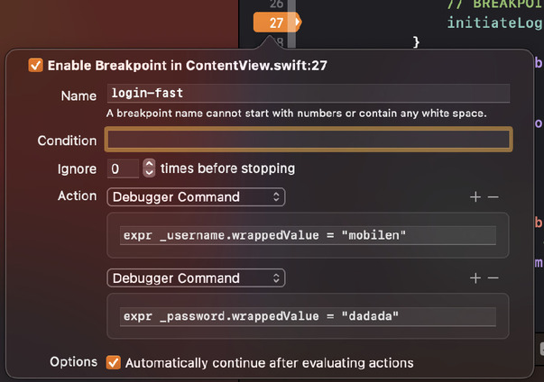

Açılan pencerede "breakpoint"'e isim verebilir, belli koşullar altında çalışmasını ayarlayabilir veya program durduktan sonra yapılacak bir aksiyon tanımlayabiliriz. Biz buton aksiyonu sonrasında "textfield"'ları geçerli bilgiler ile doldurup, programın çalışmasına devam etmesini sağlamalıyız.

Bunu yapmak için aşağıdaki "Add Action" butonuna tıklayalım. "Action" tipinin "default" olarak "debugger command" geldiğini göreceğiz. Sonrasında ise hemen altındaki alana ise tanımlayacağımız aksiyonu `expr` komutuyla belirtelim.

`expr` komutu, "expression" kelimesinin kısaltmasıdır ve "Breakpoint Actions" bölümünde kullanılan bir komuttur. `expr` komutuyla belirlediğiniz bir değişkenin değerini değiştirebilir veya bir fonksiyonu çağırabilirsiniz. Örneğin, `expr foo = 42` ile "foo" değişkeninin değerini 42 olarak değiştirebilirsiniz.

Burada ilk action'da, =_username.wrappedValue= değişkeninin değerini "mobilen" ile değiştirmek için expr _username.wrappedValue = "mobilen" komutunu kullanıyoruz.

İkinci action'da ise, =_password.wrappedValue= değişkenin değerini "dadada" ile değiştirmek için expr _password.wrappedValue = "dadada" komutunu kullanıyoruz.

Ayrıca "Action" tipi olarak "Log Message" seçeneğini de kullanılabilir ve belirlediğiniz değişkenin değerini "Console" panelinde görüntüleyebilirsiniz.
Yine "Action" tipi olarak "Sound" seçeneğini kullanabilir ve belirli bir işlem gerçekleştiğinde ses çalabilirsiniz.

Son olarak en altta bulunan =Automatically continue after evaluating actions= seçeneğini işaretleyelim. Bu =textfield='ları geçerli bilgiler ile doldurduktan sonra, programın çalışmasına devam etmesini belirlediğimiz kısımdır. Bu yüzden "checkbox"'ı işaretlemeyi atlamamalıyız.

Tüm adımları gerçekleştirdikten sonra yapmanız gereken tek şey, kodunuzu çalıştırmak ve login butonuna tıklamak. Buton aksiyonu ile beraber "textfield"'ların geçerli bilgiler ile doldurulduğunu ve modal screen'in kapatıldığını görebilirsiniz.

Bu yazıda, "breakpoint"'leri ve kullanım senaryolarını ele aldık. Ardından [[https://www.danijelavrzan.com/posts/2023/04/login-xcode-breakpoint][Login XCode Breakpoints]] yazısındaki örneklerle uygulamalarımızdaki herhangi bir alanı nasıl otomatikleştirebileceğimizi öğrendik.

"Breakpoints"’leri kullanmak geliştirme sırasında zaman kazanmanıza yardımcı olabilir ve uygulamanızı her test ettiğinizde oturum açma bilgilerinizi manuel yazmak zorunda kalmadan zaman kazanabilirsiniz.

** Kaynaklar
[[https://www.danijelavrzan.com/posts/2023/04/login-xcode-breakpoint][Login XCode Breakpoints]]

#+INCLUDE: ./resources/OrgExportSettings/OrgExportLatexNextPage.org

* XCode Project Custom File Templates
_[[https://linkedin.com/in/alimerttekel][Ali Mert Tekel]] tarafından yazıldı._

Geliştirme sürecinde her ayrıntının önemli olduğu bir dünyada yaşıyoruz. Bu karmaşık süreçte, verimliliği ve tutarlılığı artırmak için araçlardan en iyi şekilde yararlanmak gerekiyor.
Bu yazıda, iOS uygulama geliştirme sürecini daha düzgün, hızlı ve hatasız hale getirmek için Xcode'un Custom File Template'lerinin nasıl kullanılacağını ele alacağız.

Yeni başlayanlardan deneyimli geliştiricilere kadar herkesin işine yarayacak bu bilgilerle, projenizdeki geliştirme sürecini daha verimli hale getirebilirsiniz.

- Xcode :: Apple'ın macOS, iOS, watchOS ve tvOS için uygulamalar geliştirmek için kullandığı bir Entegre Geliştirme Ortamı (IDE).
- Template :: Önceden tanımlanmış bir dosya yapısı.
- Custom Xcode Template :: Kullanıcı tarafından özelleştirilmiş Xcode Template'leri.
- MVVM :: Model-View-ViewModel, bir yazılım mimarisi deseni.
- .xctemplate :: Xcode Template'lerinin dosya türü.

`File Templates`, Xcode'un özellikle iOS uygulamaları geliştirirken kullandığımız dosyaları oluşturma sürecinde kilit bir rol oynar. Her yeni dosya oluştururken, `Choose a template for your new file:` başlığı altında bir dizi template sunulur.

#+CAPTION: Template Seçimi
#+ATTR_LATEX: :width \textwidth
#+ATTR_HTML: :width 200px
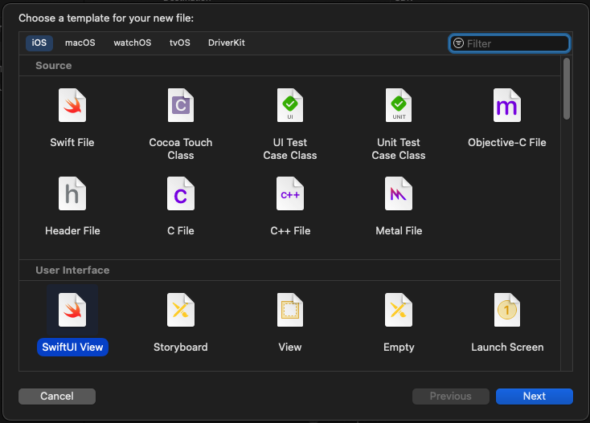

Bu template'ler, yeni oluşturulacak dosyaların belirli bir yapıya sahip olmasına yardımcı olur. Ancak, projeniz büyüdükçe ve daha fazla dosya eklemeniz gerektiğinde, aynı süreci tekrar tekrar uygulamak zaman kaybına ve tutarsızlıklara yol açabilir. İşte tam bu noktada Custom Xcode Templates devreye girer.

** Custom Xcode Template Avantajları
Custom Xcode Template, projenizin gereksinimlerine ve mimarisine uygun dosyaları hızlı ve tutarlı bir şekilde oluşturmanıza olanak sağlar. Örneğin, MVVM mimarisi gibi belirli bir mimariyi kullanırken, her sayfa için birden fazla dosya oluşturmanız gerekebilir. Bu süreci Custom Xcode Template kullanarak optimize edebilirsiniz.

** Custom Xcode Template Nasıl Oluşturulur?

İlk adım, Xcode'un template'leri barındırdığı dizini açmaktır.

Bu klasör genellikle `~/Library/Developer/Xcode/Templates/File Templates` dizininde bulunur. Eğer bu dizin mevcut değilse, manuel olarak oluşturabilirsiniz.

#+CAPTION: Templates dizinini açmak
#+ATTR_LATEX: :width \textwidth
#+ATTR_HTML: :width 100%
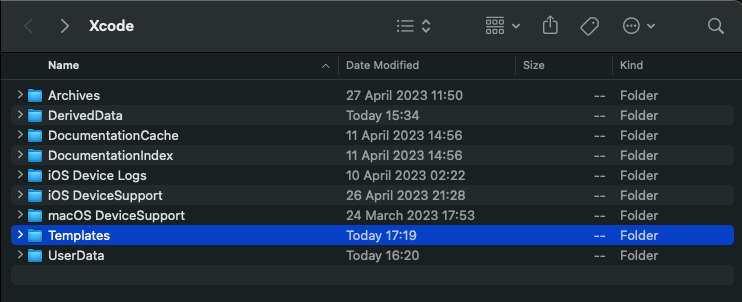

#+CAPTION: Yeni klasör oluşturmak
#+ATTR_LATEX: :width \textwidth
#+ATTR_HTML: :width 100%
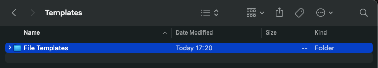

Kendi template'lerinizi barındıracak bir klasör oluşturmanız gerekmektedir. Bu klasörü adlandırırken istediğiniz ismi kullanabilirsiniz, örneğin "My Project Templates".

#+CAPTION: Custom Template barındıracak klasörü oluşturmak
#+ATTR_LATEX: :width \textwidth
#+ATTR_HTML: :width 100%
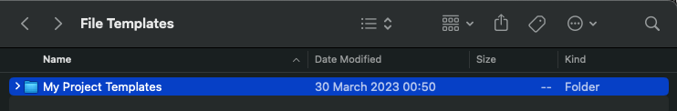

Sonrasında, `.xctemplate` uzantılı bir dosya oluşturmalısınız. Bu dosya, oluşturacağınız asıl template'i temsil eder ve template'in nasıl görüneceğini ve hangi dosyaların oluşturulacağını belirler.

#+CAPTION: Xctemplate dosyaları
#+ATTR_LATEX: :width \textwidth
#+ATTR_HTML: :width 100%
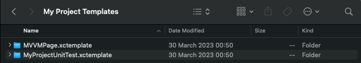

`.xctemplate` dosyası genellikle aşağıdaki öğeleri içerir:

- TemplateInfo.plist
- Dosya template'leri (Örneğin; .swift dosyaları)
- Diğer kaynak dosyaları (Örneğin; Template için icon dosyası)

*** Örnek bir TemplateInfo dosyası :noexport:
#+INCLUDE: ./resources/OrgExportSettings/OrgExportLatexSourceBlock.org
#+begin_src xml
  <?xml version="1.0" encoding="UTF-8"?>
  <!DOCTYPE plist PUBLIC "-//Apple//DTD PLIST 1.0//EN" "http://www.apple.com/DTDs/PropertyList-1.0.dtd">
  <plist version="1.0">
    <dict>
      <key>Platforms</key>
      <array>
        <string>com.apple.platform.iphoneos</string>
      </array>
      <key>DefaultCompletionName</key>
      <string>MVVM-C</string>
      <key>Description</key>
      <string>MVVM-C Page Template</string>
      <key>Kind</key>
      <string>Xcode.IDEKit.TextSubstitutionFileTemplateKind</string>
      <key>SortOrder</key>
      <integer>1</integer>
      <key>Options</key>
      <array>
        <dict>
          <key>Description</key>
          <string></string>
          <key>Default</key>
          <string></string>
          <key>Identifier</key>
          <string>pageName</string>
          <key>Name</key>
          <string>New Page Name</string>
          <key>Required</key>
          <string>YES</string>
          <key>Type</key>
          <string>text</string>
        </dict>
        <dict>
          <key>Default</key>
          <string>___VARIABLE_pageName___</string>
          <key>Identifier</key>
          <string>productName</string>
          <key>Type</key>
          <string>static</string>
        </dict>
      </array>
      <key>Template Author</key>
      <string>Ali Mert</string>
      <key>MainTemplateFile</key>
      <string>___FILEBASENAME___</string>
    </dict>
  </plist>
#+end_src

TemplateInfo dosyasındaki önemli key'ler:

=Platforms= key, bu template'in hangi platformlarda kullanılacağını belirtir. Bu örnekte, template sadece iOS (com.apple.platform.iphoneos) için kullanılabilir.

=DefaultCompletionName= key, yeni template'in varsayılan adını belirtir. Bu örnekte, yeni template'in adı 'MVVM-C' olacaktır.

=Description= key, template'in ne olduğunu ve ne için kullanıldığını açıklar. Bu durumda, template bir 'MVVM-C Page Template' olarak tanımlanmıştır.

=Options= key, template oluşturulurken kullanıcıdan alınacak girdileri belirtir. Bu örnekte, kullanıcıdan yeni bir sayfa adı talep edilir. Bu bilgi, yeni oluşturulan dosyada kullanılır.

=Template Author= key, template'in yazarını belirtir. Bu örnekte, template'in yazarı 'Ali Mert' olarak belirtilmiştir.

=MainTemplateFile= key, bir template dosyasında birden fazla dosya bulunduğunda, hangi dosyanın varsayılan olarak açılacağını belirtir.

*** Örnek bir dosya template'i;
#+INCLUDE: ./resources/OrgExportSettings/OrgExportLatexSourceBlock.org
#+begin_src swift
  // ___FILEHEADER___
  import Combine
  import Foundation
  import SwiftUI

  struct ___VARIABLE_pageName___ContentView: View {
      // MARK: Observable Objects
      @ObservedObject var viewStateData: ___VARIABLE_pageName___ViewStateData
      // MARK: Properties
      var onChangeEvent: (___VARIABLE_pageName___Event) -> Void
      // MARK: Lifecycle
      var body: some View {
          self.content()
      }
  }

  // MARK: - Views
  extension ___VARIABLE_pageName___ContentView {
      private func content() -> some View {
          VStack {
              // TODO: Add Views
          }
      }
  }
  #if DEBUG
  struct ___VARIABLE_pageName___ContentView_Previews: PreviewProvider {
      static var previews: some View {
          let initialView = ___VARIABLE_pageName___ContentView(viewStateData: .init(), onChangeEvent: { _ in })
          return Group {
              initialView
          }
      }
  }
  #endif
#+end_src

Custom Template oluşturmak ve hazır template bulabileceğiniz birkaç kaynak aşağıdaki gibidir:

*** Referenslar
1. [[https://www.kodeco.com/26582967-xcode-project-and-file-templates][Kodeco]]: Bu kaynakta kapsamlı bir şekilde custom template oluşturma süreci anlatılıyor.

2. [[https://github.com/topics/xcode-templates][Github Xcode Templates]]: Github'da "xcode-templates" topic'i ile genellikle proje mimarileri için oluşturulmuş template repolarına ulaşabilirsiniz.

Özetle, bu adımlar, Custom File Template'lerinizi oluşturmak için iyi bir başlangıç noktası olabilir. Ancak, her projenin kendine özgü ihtiyaçları olduğunu ve bu adımların projenizin spesifik gereksinimlerine göre uyarlanması gerektiğini unutmamak önemlidir.
Bu sayede, projenizin verimliliğini ve tutarlılığını artırarak, uygulama geliştirme sürecinizin kalitesini yükseltebilirsiniz.

#+INCLUDE: ./resources/OrgExportSettings/OrgExportLatexNextPage.org

* iOS Deep Link: Mobil Uygulamaların Gizli Kahramanı
_[[https://linkedin.com/in/egehan-kalaycı-736b4a238][Egehan Kalaycı]] tarafından yazıldı._

Selam "Mobilen" okurları! Bugün sizinle çok önemli ve aslında fazlasıyla işlevsel bir konuyu konuşacağız: Deep Link'leri. Evet, belki ilk duyduğunuzda biraz karışık gelebilir ama emin olun, bu yazıyı okuduktan sonra onları tanıyan en iyi kişi siz olacaksınız.

** Deep Link Nedir?

Deep link, belirli bir sayfaya veya işleme mobil uygulama içinde doğrudan erişmenizi sağlayan bir tür bağlantıdır. Böylece, kullanıcıları uygulamanın belirli bir noktasına yönlendirerek, daha etkileşimli ve kullanıcı odaklı bir deneyim sunabiliriz.

*** Biraz Daha Somutlaştıralım
Örneğin, Instagram'da dolaşırken bir Petrol Ofisi kahve kampanyası gördünüz ve tıkladınız. İşte tam da burada devreye deep linkler giriyor. Tıkladığınızda, direkt olarak Petrol Ofisi'nin mobil uygulaması açılıyor ve sizi o özel kampanyaya yönlendiriyor. Kulağa hoş geliyor değil mi?

Veya belki de şifrenizi sıfırlamanız gerekiyor ve bu durumda da gelen e-postadaki linke tıkladığınızda, sizi bir web sayfasına yönlendirmek yerine direkt olarak uygulamada güzel ve kullanıcı dostu bir deneyim yaşamanızı sağlıyor. İşte bu, deep linklerin gücü!

** Deep Link’in Küçük Detayları

Deep linklerin kullanımı oldukça basit gibi görünse de, yönetilmesi gereken bazı durumlar vardır. Bu detaylar, uygulamanın nasıl ve ne zaman hangi deep linki kullanacağını belirler. Ama merak etmeyin, bu yazının ilerleyen bölümlerinde bunları ayrıntılı olarak ele alacağım.

** Deep Link Çeşitleri

**Dinamik Linkler:**
Dinamik linkler, kullanıcıları belirli bir içeriğe veya uygulama içi konuma yönlendirmek için kullanılır. Bu linkler "dinamik" olarak adlandırılır çünkü onlar hem uygulama içi hem de web içeriğine yönlendirebilir. Örneğin, bir kullanıcı uygulamanızı henüz indirmediyse, dinamik bir link onları App Store veya Google Play'e yönlendirebilir. Eğer uygulama zaten yüklüyse, aynı link onları uygulama içindeki belirli bir konuma yönlendirebilir. Bu özellik, kullanıcının deneyimini optimize etmek için önemlidir.

**Deferred Deep Linking:**
Deferred Deep Linking, deep linking'in bir formudur ve uygulama önceden yüklenmemişse bile belirli bir içeriğe veya uygulama içi konuma yönlendirmeyi mümkün kılar. Eğer bir kullanıcı uygulamayı henüz indirmediyse, bu tür bir link önce onları App Store veya Google Play'e yönlendirir. Uygulama indirildikten ve açıldıktan sonra, kullanıcı otomatik olarak belirtilen içeriğe veya konuma yönlendirilir.

Farklarına gelince, her ne kadar her iki tür link de uygulamanın indirilmesi ve belirli bir konuma yönlendirilmesi sürecini yönetse de, genellikle Dinamik Linkler daha geniş özelliklere sahip olup, kullanıcıları yönlendirme ve deneyimlerini özelleştirme konusunda daha fazla esneklik sunar. Örneğin, Dinamik Linkler genellikle linkin nereden geldiğini (örneğin, bir e-postadan, sosyal medyadan, bir reklamdan vb.) izleme ve bunun yanı sıra kullanıcının işletim sistemini ve cihazını algılama yeteneğine sahiptir, böylece en uygun deneyimi sunabilir. Bu nedenle, Dinamik Linkler genellikle pazarlama kampanyalarında ve kullanıcı etkileşimlerini artırmak için kullanılır.

** Deep Link Yönetim Yöntemleri

Deep linklerinizi hem iOS hem Android uygulamalarınızda yönetebilmeniz için iki önemli yöntem bulunmaktadır: URL Scheme ve Universal Link (iOS) veya App Links (Android). Bu yöntemler, uygulamalarınızdaki deep linklerin yönetimini kolaylaştırır ve kullanıcı deneyimini artırır. Ancak her bir yöntemin kendine özgü özellikleri ve kullanım alanları vardır. Bu yüzden, hangi yöntemin sizin uygulamanız için en uygun olduğunu belirlemek önemlidir.

** Deep Link: URL Scheme ve Universal Link Karşılaştırması

Deep link yönetiminde kullanılan iki temel yöntem olan URL Scheme ve Universal Link, birbirinden farklı özelliklere sahiptir. Hem geliştiricilerin hem de kullanıcıların deneyimini doğrudan etkileyen bu özellikler, hangi yöntemin hangi durumda kullanılacağını belirler.

URL Scheme ve Universal Link’in karşılaştırmalı tablosu:

*** URL Scheme
- **Kurulumu Basittir:** URL Scheme'yi kullanmaya başlamak için karmaşık bir kurulum sürecine ihtiyaç duyulmaz.
- **SSL Zorunluluğu Yoktur:** URL Scheme, SSL sertifikası zorunluluğu olmadan kullanılabilir.
- **Kullanıcı Onayı İster:** URL Scheme, uygulamaya erişim izni almak için kullanıcıya bir pop-up gösterir. Bu, kullanıcıların uygulamayı açma konusunda daha bilinçli olmasını sağlar.
- **Uygulama Yüklü Değilse Çalışmaz:** URL Scheme, uygulamanın cihazda yüklü olmasını gerektirir. Eğer uygulama yüklü değilse, URL Scheme çalışmaz.
- **Aynı Tanımlar ve Kod Mantığı Gerekli:** URL Scheme'in hem iOS hem de Android platformlarında çalışabilmesi için, tanımlarının ve URL'i işleyen kod mantığının aynı olması gerekmektedir.
- **Kullanıcı Dostu Değildir:** URL Scheme linkleri genellikle "myApp://page/profile" gibi görünürler ve bu da genellikle kullanıcılar için anlaşılması zor olabilir.

*** Universal Link
- **Kurulumu Komplekstir:** Universal Link'in kurulum süreci, URL Scheme'e göre daha karmaşıktır.
- **SSL Zorunludur:** Universal Link kullanımı için SSL sertifikası zorunludur. Bu, uygulamanın güvenlik seviyesini artırır.
- **Erişim İzni İstemez:** Universal Link, uygulamaya erişim izni almak için kullanıcıdan herhangi bir onay istemez.
- **Uygulama Yüklü Değilse Yedek URL'ler Kullanır:** Eğer uygulama cihazda yüklü değilse, Universal Link yedek bir URL'ye yönlendirme yapar. Bu, kullanıcıların her zaman istedikleri içeriğe ulaşabilmesini sağlar.
- **Oluşturulan Link Tüm Platformları Destekler:** Universal Link ile oluşturulan bir link, tüm platformlarda çalışabilir.
- **Gündelik Kullanılan Linkler Gibidir:** Universal Linkler, kullanıcı dostudur ve gündelik internet kullanımında karşılaştığımız web adreslerine benzerler. Örneğin, "www.myapp.com/page/profile" gibi.

Bu özellikler, URL Scheme ve Universal Link arasında önemli farklar olduğunu gösterir. Seçiminiz, uygulamanızın ihtiyaçlarına, hedeflerinize ve kullanıcı deneyiminizi nasıl şekillendirmek istediğinize bağlı olacaktır. Unutmayın, her iki yöntemin de kendi güçlü ve zayıf yanları vardır. Önemli olan, hangi yöntemin sizin ve kullanıcılarınızın ihtiyaçlarını en iyi şekilde karşılayacağını belirlemektir.

Şimdi, daha fazla derine dalalım ve URL Scheme ve Universal Link'in nasıl çalıştığını inceleyelim...

** URL Scheme: Nedir ve Nasıl Kullanılır?

URL Scheme, iOS ve Android platformları için belirli bir URL şemasını kaydedip, diğer uygulamaların bu şema ile başlayan URL'leri açabilmesini sağlayan bir deep link yöntemidir. Peki, nasıl çalışır? Hadi gelin adım adım birlikte inceleyelim.

*** URL Scheme: Nasıl Tanımlanır?

URL Scheme'in kurulumu oldukça basittir. Örneğin, bir iOS uygulamasına URL Scheme nasıl tanımlanır, birlikte bakalım.
1. Öncelikle, Xcode'u açıyoruz.
2. Ardından, `Project Settings -> Info` yolunu izliyoruz.
3. Bu bölümde "URL Types" kısmına yeni bir URL Scheme tanımı yapabiliyoruz.

#+ATTR_LATEX: :width \textwidth
#+ATTR_HTML: :width 100%
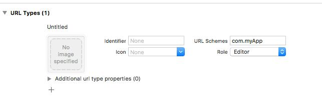
Bu şekilde bir tanımlama yaptıktan sonra, telefonumuzdan bir tarayıcı veya notlar uygulamasına gidip bu linki test edebiliriz. "com.myApp" yazıp enter'a tıkladığımızda fark ederiz ki, bir şey olmamıştır.

Peki, bu durum neden oluşur? İşin aslı, iOS'un bir metni bağlantı olarak tanıması için, URL formatına uygun olmamızı bekler. Yani linkimizi "com.myApp://main" olarak güncellemeliyiz. Bu formatı girdiğimizde, bir izin pop-up'ı ile karşılaşırız. Eğer burada "Aç" diyerek izin verirsek, linkin uygulamamızı açtığını görebiliriz.

#+ATTR_LATEX: :width 0.5\textwidth
#+ATTR_HTML: :width 100%
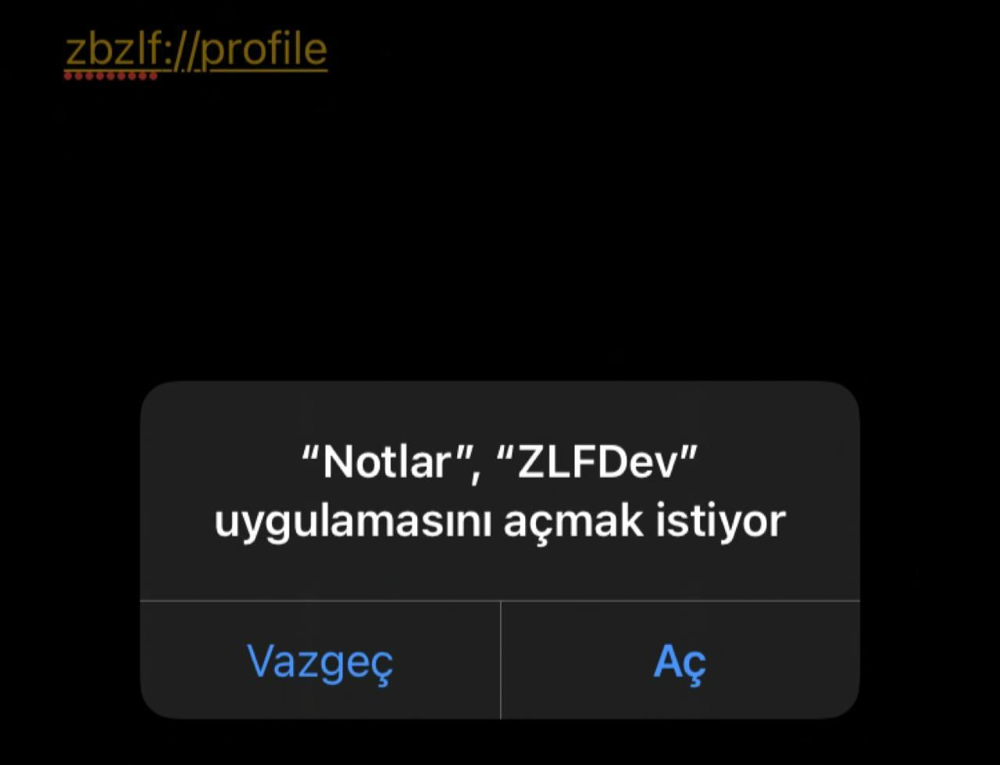
Fakat, evet uygulamayı açtık ama henüz uygulama içerisinde bir yönlendirme yapmadık. Mesela uygulamanın "profil bilgilerim" sayfasına gitmek istiyoruz. Peki, bunu nasıl yapabiliriz?

*** URL Scheme ile Uygulama İçi Yönlendirme
Bu işlem için "AppDelegate.swift" dosyasını kullanacağız. Bu dosyada bulunan `open url: URL` metodu, başka bir uygulama veya sistem bileşeni tarafından gönderilen URL'yi yakalayıp işlememizi sağlar.

Hatırlayalım, bir metnin bağlantı olabilmesi için "scheme://host" yapısına uyması gerektiğini belirtmiştik. Şimdi bu yapının bir örneğini inceleyelim. Örneğin, `com.myApp://content?contentID="1881"` şeklinde bir URL tanımlayalım.

Bu URL'deki parametreleri elde etmek ve bunları kendi yönlendirme yapımıza göre işlemek için aşağıdaki gibi bir kod yapısına ihtiyacımız bulunmaktadır.

#+ATTR_LATEX: :width \textwidth
#+ATTR_HTML: :width 100%
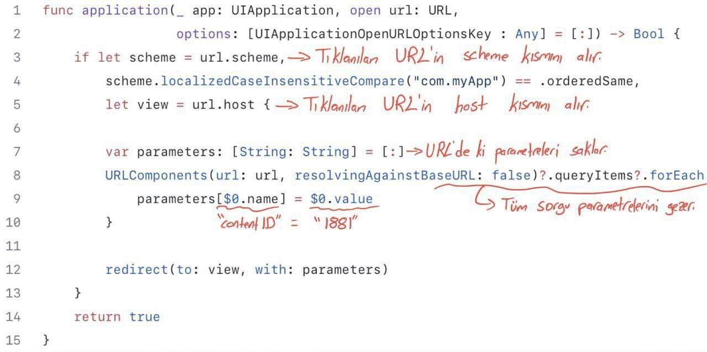
Bu kod yapısında,
- `url.scheme` = "com.myApp"
- `url.host` = "content"
- `parameters` = ["contentID" : "1881"]
olacaktır.

*** URL Scheme: Sonuç
URL Scheme, tanımlanması ve uygulanması oldukça kolay bir deep link yöntemidir. Ancak, bu yöntemin en büyük dezavantajı, uygulamanın cihazda yüklü olmaması durumunda çalışmamasıdır. Bu durumda, kullanıcı boş bir web sayfasıyla karşılaşacaktır.

İşte tam bu noktada Universal Link ve App Links yöntemleri devreye giriyor. Bu yöntemler, URL Scheme'in karşılaştığı bu sorunu çözerek kullanıcı deneyimini daha da iyileştirebilir. Şimdi biraz daha derinlere inelim ve Universal Link ve App Links yöntemlerini inceleyelim...

*** Universal Link/App Links: Nedir?
Universal Link ve App Links, URL Scheme'in dezavantajlarını azaltmak için iOS 9/Android 6.0 ve sonraki sürümlerde kullanılabilen bir deep link yöntemidir.

Bu yöntem, URL Scheme'in dezavantajlarını giderirken, kurulumun daha karmaşık olmasını beraberinde getirir.

Kurulum adımlarını ve örneklerimi iOS özelinde veriyor olacağım fakat konsepti anlamamız yeterli olacaktır. Çünkü Android’de de olaylar birbirine çok benzer.

Özellikle, Universal Link'lerin en genel anlamıyla, bir web sayfası URL'sini iOS uygulamanızla ilişkilendirmenizi sağlar. Böylece o URL'yi açtığınızda iOS, mobil uygulamanızı tanır.

Ama burada bir sorun var mıdır? Örneğin, "myApp" adlı uygulamanızı Instagram'ın URL'si ile ilişkilendirip, iPhone'dan Instagram'a giren herkesin sizin uygulamanıza yönlendirilmesini sağlayabilir misiniz? Tam bu sorunu çözmek için iOS, URL'lerin arkasına bir JSON dosyası eklemenizi ve bunu "/apple-app-site-association" yolunda yer almasını ister. Böylece kullanıcılar "https://www.instagram.com/egehannkalaycii" gibi bir linke tıkladığında, iOS öncelikle "https://www.instagram.com/apple-app-site-association" linkindeki JSON dosyasına bakar ve bu URL'in hangi uygulamayla ilişkili olduğuna bakar.

*** JSON Dosyası Yapısı
JSON dosyası dedik. Peki bu JSON dosyasının yapısında neler var?
Bu JSON dosyasının yapısı genellikle aşağıdaki gibidir:
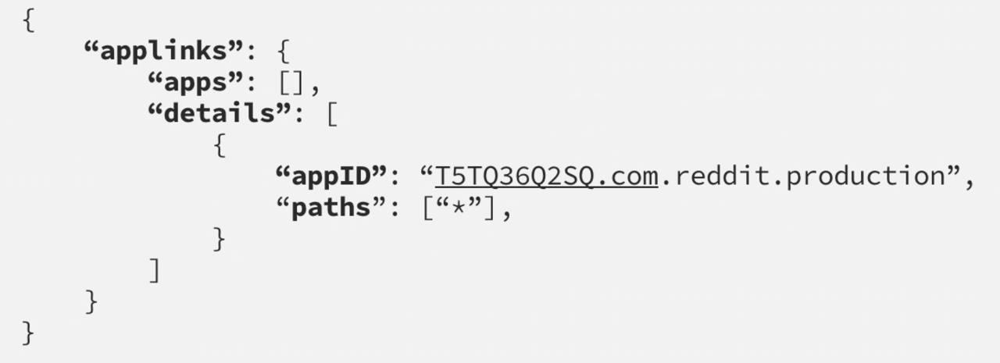
- applinks: Bu JSON'ın Universal Link olduğunu belirtir.
- apps: Apple dokümanına göre bu değer boş bırakılmalıdır.
- details: Uygulama listesi ve yolları içerir.
- appID: TeamID + BundleID değerlerinden oluşur.
- paths: Uygulamada gidilebilecek yolların tanımıdır.
  - `Path’leri tanımlarken bazı detaylar bulunur. Bunlar:
    - “/wwdc/news/”-> Standart path tanımı.
    - “NOT /videos/wwdc/2010/”-> Başında ****NOT**** olanlar path’e dahil olmaz.
    - “*” veya “/wwdc/2010/*"-> WWDC’nin 2010 klasörü altındaki tüm yolları tanımlar.
    - “/wwdc/201?/”-> ? olan yere herhangi bir karakter gelebilir.
    - Bu bilgiler ışığında aşağıdaki gibi bir path tanımı yapmak mümkün.
    - “/wwdc/videos/201?/*”

*** Universal Link/App Links: Nasıl Tanımlanır?

Universal Link veya App Links yeteneğini kullanmak için öncelikle "https://developer.apple.com/account/resources/identifiers/list" adresine gidip, uygulamanızı seçmeniz gerekiyor. Daha sonra "Capabilities" sekmesi altından, "Associated Domains" özelliğini aktif hale getiriyorsunuz.

Xcode'da, sol menüden projenizi seçtikten sonra sırasıyla: Target -> Signing & Capabilities -> Associated Domains sekmesine geliriz. Associated Domain ekleriz. Burada dikkat etmemiz gereken nokta, URL'nizin "applinks: domainName.com" şeklinde tanımlanmasıdır.

Bu adımların ardından, Universal Link yeteneğiniz aktif hale gelmiş olacaktır. Bu yeteneği test etmek için, telefonunuzdan Safari'ye gidip uygulamanızın web sitesine giderseniz, iOS otomatik olarak bir öneri sunacaktır.

#+ATTR_LATEX: :width 120px
#+ATTR_HTML: :width 100%
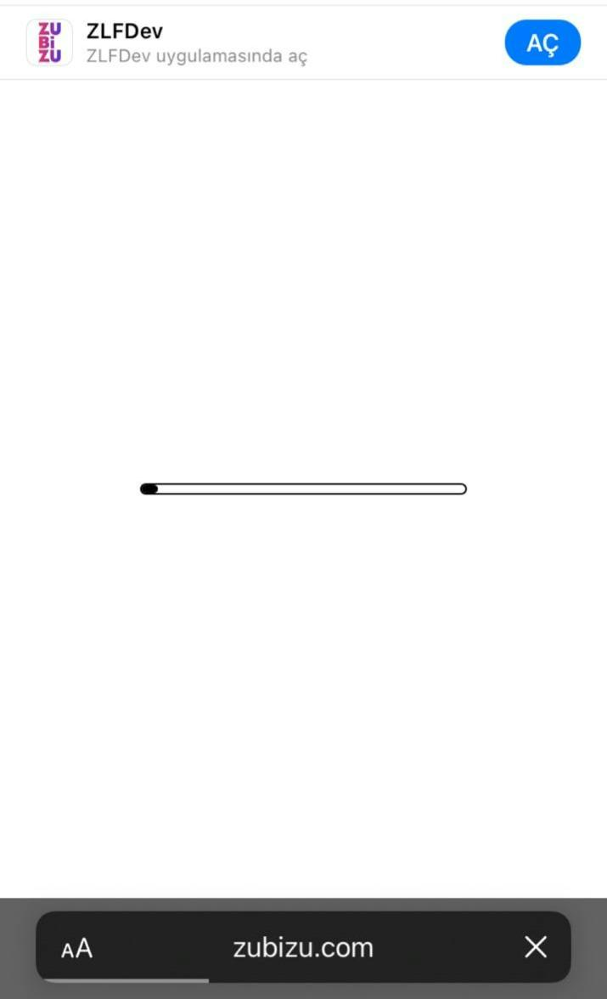

*** Uygulama İçi Yönlendirme
Universal Link yeteneğini ekledikten sonra, uygulamanızın belirli bir sayfasına yönlendirebilmek için URL'yi karşılayacak bir metot belirlememiz gerekiyor. Bu metot, genellikle AppDelegate dosyasında bulunur.

URL Scheme'de linklerimizi "open url: URL" metodunda handle ediyorduk, ancak Universal Link yönlendirmelerini "continue userActivity: NSUserActivity" metodunda handle ediyoruz.

#+ATTR_LATEX: :width 340px
#+ATTR_HTML: :width 80%
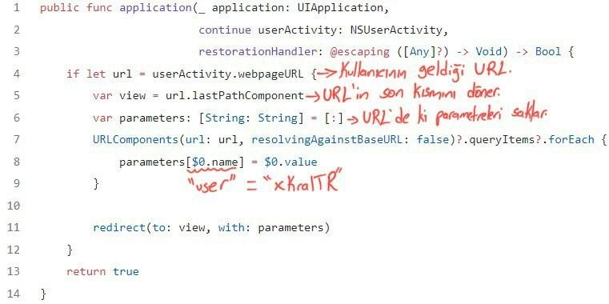
Örneğin, "www.myApp.com/app/profile" gibi bir linke tıkladığınızda bu metot handle edecektir.

Bu kod yapısında,
- `url` = "www.myApp.com/app/profile?user=xKralTR"
- `view` = "profile"
- `parameters` = ["user" = "xKralTR"]
olacaktır.

Bu bilgilerin ışığında, uygulamanızın belirli bir sayfasına yönlendirebilme yeteneğine sahip olmuş olursunuz. Bu, uygulamanızın kullanıcı deneyimini önemli ölçüde geliştirebilir ve kullanıcıların uygulamanız içerisinde daha kolay bir şekilde gezinmelerini sağlar.

Son olarak, tüm bu bilgileri özetleyen bir diyagramı incelemek, konsepti daha iyi anlamanızı sağlayabilir. Aşağıya bununla ilgili bir diyagram bırakıyorum. Yazımı okuduğunuz için teşekkürler, bir sonraki yazılarda görüşmek üzere.

#+ATTR_LATEX: :width 0.6\textwidth
#+ATTR_HTML: :width 100%
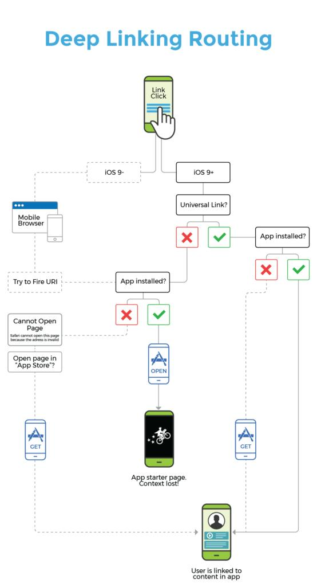

** Kaynaklar
1. [[https://medium.com/@ydemirkoparan/swift-ile-deep-linking-nas%C4%B1l-yap%C4%B1l%C4%B1r-e815fee93b97][Swift ile DeepLinking nasıl yapılır?]]
2. [[https://medium.com/wolox/ios-deep-linking-url-scheme-vs-universal-links-50abd3802f97][iOS Deep Linking Scheme vs Universal Links]]

#+INCLUDE: ./resources/OrgExportSettings/OrgExportLatexNextPage.org

* Evolution of the Medium iOS app architecture
_[[https://linkedin.com/in/myusufka][Yusuf Kaya]] tarafından yazıldı._

Her alanda olduğu gibi bir mobil projesinde de sürekli olarak gelişen teknolojik trendlere uyum sağlamak da büyük bir önem taşımaktadır.

Yeni mimari geliştirmeler, bir projenin başarısı için hayati bir rol oynamaktadır. Bu geliştirmeler, uygulamanın performansını artırırken, güvenlik açıklarını kapatmak ve gelecekteki ihtiyaçlarını karşılamak için tasarlanır.

Yeni mimari yaklaşımlar, yazılım mühendislerine daha etkili bir şekilde çalışabilmeleri için daha fazla esneklik ve verimlilik sağlamayı amaçlar. Ayrıca, proje ekibine, uygulamanın yaşam döngüsü boyunca sürekli iyileştirmeler yapma ve yeni özellikler eklemek için daha iyi bir temel sunmayı amaçlar. Modüler mimari de projelerin geliştirilmesinde önemli bir yer tutan yenilikçi bir yaklaşımdır.

[[https://medium.com/medium-eng/evolution-of-the-medium-ios-app-architecture-8b6090f4508e][Evolution of the Medium iOS App Architecture]] yayınında da Medium'un iOS uygulamasının modüler mimari evrimini anlatmaktadır.

** Modüler Mimari Nedir?
Modüler mimari, projelerin geliştirilmesinde kullanılan bir mimari yaklaşımıdır. Bu yaklaşım, bir uygulamayı bağımsız bileşenlere veya modüllere ayırarak, her bir modülün kendi sorumluluk alanına odaklanmasını ve birbirleriyle minimum bağımlılık içinde çalışmasını sağlar.
*** Modüler Mimarinin Faydaları
Modüler mimarinin faydaları şunlardır:
- Daha iyi organizasyon: Modüller arasında sorumluluk alanlarına odaklanarak projenin daha iyi organize edilmesi sağlanır.
- Paralel geliştirme: Farklı modüller, ayrı ekipler tarafından aynı anda geliştirilebilir.
- Yeniden kullanılabilirlik: Modüller, başka projelerde veya farklı parçalarda kolayca yeniden kullanılabilir.
- Bakım kolaylığı: Bağımsız modüllerin yönetimi, hataların tespitini kolaylaştırır ve bakım sürecini iyileştirir.
- Ölçeklenebilirlik: Projeyi büyütme veya değiştirme gerektiğinde, modüller arasındaki etkileşim minimum düzeyde olduğu için ölçeklenebilirlik sağlanır.
** Medium Uygulamasının Evrimi
Bu bilgiler ışığında Medium'un iOS uygulamasının mimarisinin evrim serüveninin inceleyebiliriz. Kullanılan yeni teknikler ve yaklaşımlar, bu süreçte yaşanan zorluklar ve çıkarılan dersler bakımından faydalı bir yayın olduğunu düşünüyorum. Keyifli okumalar dilerim.
** Kaynaklar
1. [[https://medium.com/medium-eng/evolution-of-the-medium-ios-app-architecture-8b6090f4508e][Evolution of the Medium iOS App Architecture]]
