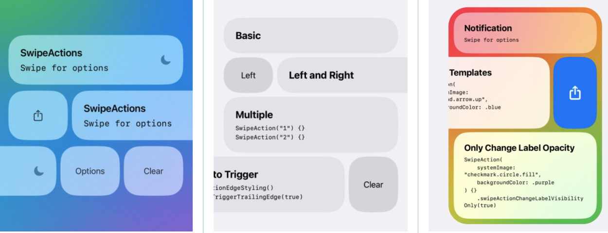

:PROPERTIES:
:ID:       20230508T135522.225628
:END:
#+title: Mobilen Dergi 2
#+author: ---

#+BEGIN_EXPORT latex
\includepdf[pages=1]{./resources/mobilen/dergi_1/mobilen-sayi-1-kapak.pdf}
#+END_EXPORT

#+INCLUDE: ./resources/OrgExportSettings/OrgExportMobilenLatexSettings.org

* TODO WWDC 2023 Gelişmeleri :iOS:Apple:
_Kim tarafindan yazilabilir_

* TODO XCodes Versiyon Yönetim Uygulaması :xcode:iOS:
_[[https://linkedin.com/in/egehan-kalaycı-736b4a238][Egehan Kalaycı]] tarafından yazılabilir._

https://github.com/XcodesOrg/xcodes
brew install xcodesorg/made/xcodes

* iOS SwiftUI Swipe Actions :SwiftUI:iOS:
_[[https://tr.linkedin.com/in/suat-karakusoglu][Suat Karakuşoğlu]] tarafından yazıldı._

#+CAPTION: Örnek Swipe Actions
#+ATTR_LATEX: :width \textwidth
#+ATTR_HTML: :width 100%

** Swipe Actions nedir?
Merhabalar, herhangi bir ui elemanının üzerinden =swipe= ile çıkan aksiyonlar iOS kullanıcı deneyiminde önemli rol oynuyor.

Kullanıcı deneyimi açısından view'ın altında gizli, sağından veya solundan çıkan bu aksiyonlar görünmüyor olsa bile özellikle iOS kullanıcıları bu davranışı listelerde arayabiliyor.

Davranış olarak sağ ve sol demek yerine burada tercih edilen jargon =leading= ve =trailing=, bunun başlıca sebebi dillerin sağdan sola veya soldan sağa olarak 2 farklı şekilde yazılabilmesi.
Soldan sağa yazılan dillerde sol-leading, sağ trailing iken, arapça-farsça gibi dillerde sol-trailing, sağ ise leading olmakta.

Swipe aksiyonları yazabilmek için yardımcı araçlar mevcut.

=Native= olarak SwiftUI tarafından iOS 15 ile SwiftUI List'elerine eklendi.
[[https://developer.apple.com/documentation/swiftui/view/swipeactions(edge:allowsfullswipe:content:)][iOS 15 SwiftUI SwipeActions]] adresinden native yöntem incelenebilir.

Ancak iOS-14 destekliyorsanız veya herhangi bir SwiftUI view'e swipe aksiyonları eklemek isterseniz bunun için güzel bir SwiftUI component'i açık kaynak olarak geliştirilip github'a =spm= destekli olarak koyulmuş.

Bu yazımızda [[https://github.com/aheze/SwipeActions][Açık Kaynak SwipeActions Reposu]]'nu inceleyeceğiz.

** SwipeActions Kullanımı
#+INCLUDE: ./resources/OrgExportSettings/OrgExportLatexSourceBlock.org
#+begin_src swift
  import SwiftUI
  import SwipeActions

  struct ContentView: View {
      var body: some View {
          SwipeView {
              Text("Hello")
                .frame(maxWidth: .infinity)
                .padding(.vertical, 32)
                .background(Color.blue.opacity(0.1))
                .cornerRadius(32)
          } trailingActions: { _ in
              SwipeAction("World") {
                  print("Tapped!")
              }
          }
            .padding()
      }
  }
#+end_src

** Kaynak Kod Okuma: =PreferenceKey= kullanımı
Veri iletişimi view componentleri arasında Environment Objeler uzerinden =Parent= → =Child= view yönünde olabiliyor.
Veya data binding ile =@Binding= çift taraflı =reactive= şekilde sağlanabiliyor.

PreferenceKey ile olan bu veri iletişiminde ise diğer bir ihtiyaç olan ise =child= → =parent= arasında veri geçişi yapabiliyoruz.

#+INCLUDE: ./resources/OrgExportSettings/OrgExportLatexSourceBlock.org
#+begin_src swift
  struct AllowSwipeToTriggerKey: PreferenceKey {
      static var defaultValue: Bool? = nil
      static func reduce(value: inout Bool?, nextValue: () -> Bool?)
      { value = nextValue() }
  }
#+end_src

Preference key tanımlarken ihtiyaç duyulan =PreferenceKey= protocol'unu =conform= etmek.
Bunun için bir varsayılan değer =defaultValue= gerekiyor.
Ayrıca ikinci olarak =reduce= fonksiyonu, bu fonksiyon dışarıdan sağlanan değerin preference olarak set edilmesine müdahale edilebilecek noktayı sağlıyor.

Kullanımı için 2 tane =modifier='imiz mevcut: =preference= ve =onPreferenceChange=.

Preference Key ile veriyi yukarı aktarma:
#+INCLUDE: ./resources/OrgExportSettings/OrgExportLatexSourceBlock.org
#+begin_src swift
  view.preference(key: AllowSwipeToTriggerKey.self, value: allowSwipeToTrigger)
#+end_src

Preference Key ile aşağıdan gelen veriyi okuma:
#+INCLUDE: ./resources/OrgExportSettings/OrgExportLatexSourceBlock.org
#+begin_src swift
  view.onPreferenceChange(AllowSwipeToTriggerKey.self) { allow in
      /// Unwrap the value first (if it's not the edge action, `allow` is `nil`).
      if let allow {
          swipeToTriggerLeadingEdge = allow
      }
  }
#+end_src

Ayrıca apple sdk'inde de =navigationTitle= modifier'i ile =preference key= kullanılarak =child= üzerinden çağırılan bir method ile üst view'deki =title='i değiştirebiliyor.

Özetle hiyerarşide yukarı veri taşıyabilmek için kullanılan bu yapının kullanıldığını görüyoruz.
Daha detaylı anlamak için [[https://swiftwithmajid.com/2020/01/15/the-magic-of-view-preferences-in-swiftui/][Magic of View Preferences in SwiftUI]] yazısına göz atabilirsiniz.

** Kaynaklar
1. [[https://developer.apple.com/documentation/swiftui/preferences?changes=_7][Apple PreferenceKey Dokümantasyonu]]
2. [[https://swiftwithmajid.com/2020/01/15/the-magic-of-view-preferences-in-swiftui/][Magic of View Preferences in SwiftUI]]

#+INCLUDE: ./resources/OrgExportSettings/OrgExportLatexNextPage.org

* Instagram'in Hikayesi :Development_History:
_[[https://tr.linkedin.com/in/suat-karakusoglu][Suat Karakuşoğlu]] tarafından yazıldı._

Sosyal hayatımızın en önemli aktörlerinden birisi olan Instagram'ın geçmişine dair kısa bir yazı.
https://medium.com/@katiemay36/transforming-burbn-to-instagram-b66245881d02

Yazıda rastladığım konular:

Burada Instagram'ın Foursquare gibi bir çok yetenek ve harici yetenekleri de yapmaya çalıştığı zamanlar olduğunu görüyoruz.
** Zawinski's law
#+begin_quote
"Every program attempts to expand until it can read mail. Those programs which cannot so expand are replaced by ones which can."

"Her program email okuyucusu olana kadar gelişir, gelişmeyenler ise gelişenler ile değiştirilir."

--- Jamie Zawinski
#+end_quote

Jamie Zawinski bu kurala "Law of Software Envelopment" diyor.
